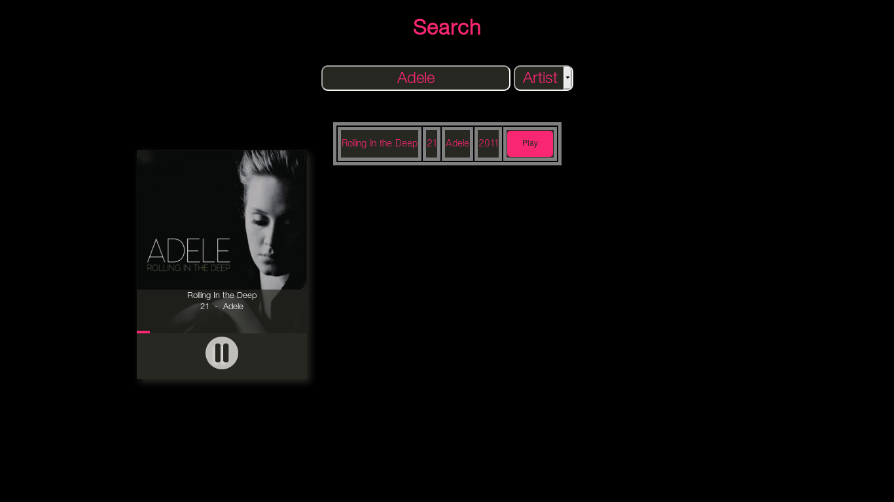

# MusicHub
###### Written in golang by @aki237 and @hermes
A music stash and search server.
## Synopsis
+ Installation
+ Usage
+ Contributing

### Installation

I exactly don't know the `go get` way to get the source as my "gospace" is different.


Probably you have to make a folder structure as follows.....(If you are ready to mess around with the import statements, just skip this.....)
 Make a folder `server` under `src/` folder.
Inside that folder:
```shell
git clone https://github.com/aki237/MusicHub server
```

And another most important gosrc in the sqlite3 driver to process sqlite3 requests using the `database/sql` go header.
```shell
go get github.com/mattn/go-sqlite3
```
Now alter the import in the serveraux or copy go-sqlite3 to `$GOPATH/src/server/` folder. Probably your workspace must be similar to mine.
This projects is of five parts....
1. main server (`server/server`)
2. server's functions (`server/server/serveraux/`)
3. sqlite3 driver (`server/gosqlite3`)
4. MP3 Metadata Parser(`server/server/mp3metap`)
5. md5 checksum finder (`server/server/returnMD5`)

Probably we won't touch the go-sqlite3..... So let us compile it into library. Else while running each time it take quite some time to compile.
```
cd $GOPATH/src/server/go-sqlite3
go install
```
This will compile that into a library.
Now lets compile all other components and run the server.....
#### Installing the returnMD5 component :
```
cd $GOPATH/src/server/server/returnMD5
go install
```
#### Installing the mp3 metadataparser :
```
cd $GOPATH/src/server/server/mp3metap
go install
```
#### Installing the server auxiliary script :
```
cd $GOPATH/src/server/server/serveraux
go install
```
#### Installing the main server and running it:
```
cd $GOPATH/src/server/server/
go install
$GOPATH/bin/server
```
The program will be listening at the port 1080 in your localhost for now. You can change that by altering the line [15 in main.go](https://github.com/aki237/MusicHub/blob/master/main.go#L15).

### Usage

+ Search the keyword in your database to list out songs

+ Upload to upload your music........(This records the mp3 metadata in the database)

+ API Page - http://[server]:[port]/api
+ Credits - Obvious
+ 404 - This is One easter egg smeared page :P

### Contributing
+ Get a good grasp of golang.([This book](https://www.golang-book.com/) is fast and awesome)
+ Please report any issues of loopholes in this project.


###### Extras
My general website aesthetics is crap.... So thats your job to beautify your site
